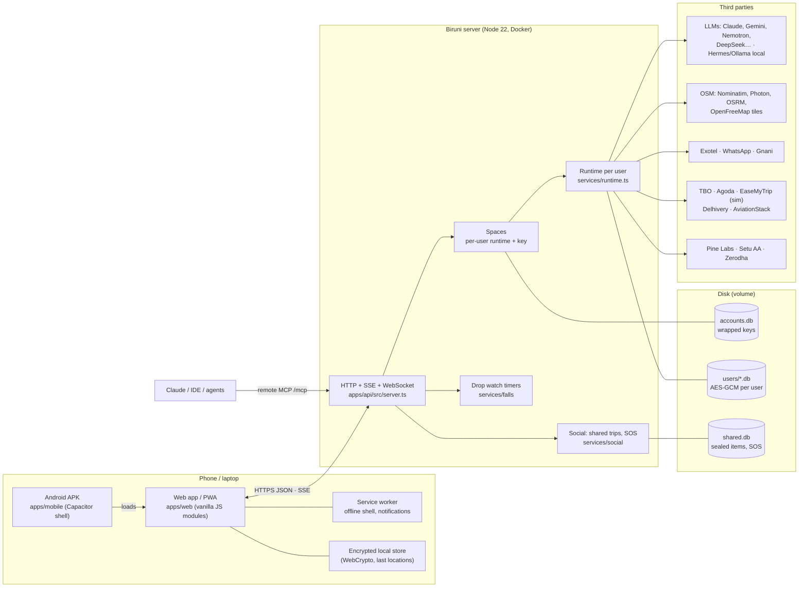
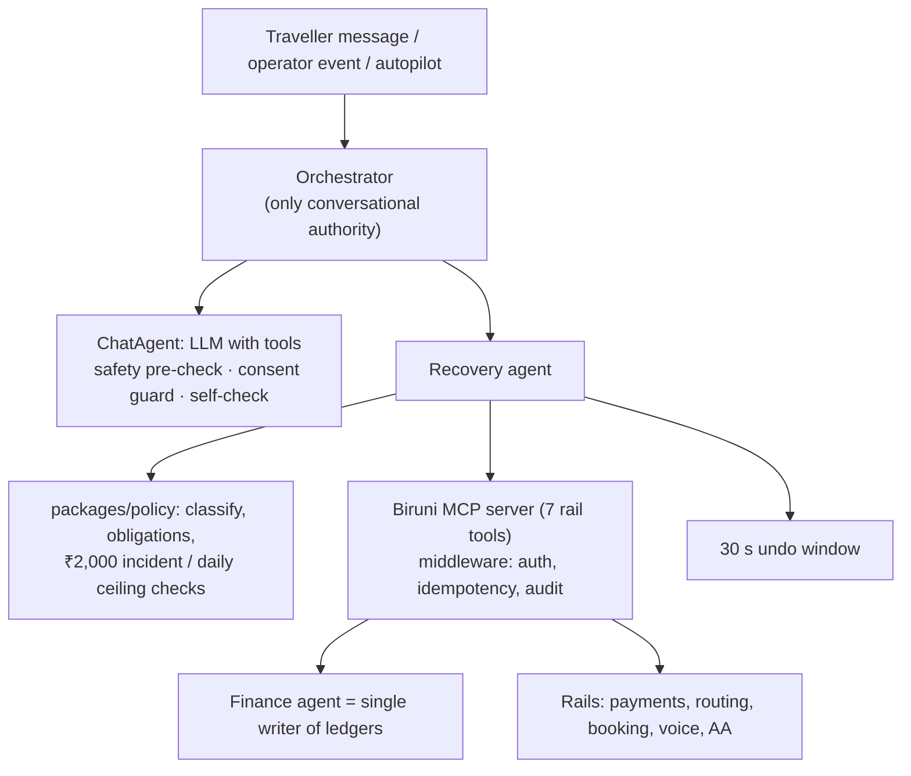
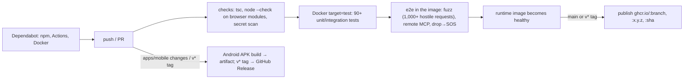

# Biruni — systems architecture

Biruni is one Node 22 server, with no build step, plus a browser app that is also a PWA and an Android shell. Each user's data lives in their own encrypted SQLite space. Everything that touches money or safety is decided by deterministic code; models only propose.

## 1. Deployment view

## 2. Request lifecycle

1. **`server.ts`** parses the URL. A bad URL gets a 400 and never hangs. It then applies security headers.
2. **Sign-in** (`/api/lock/*`): `Spaces` derives the key-encryption key from the PIN with Argon2id, unwraps the user's data key (DEK), and builds or reuses that user's runtime. The session is an HttpOnly, SameSite=Strict cookie.
3. **Hooks with no session** check their own token and run as the service user. These are the SMS feed, Exotel SMS and stream, WhatsApp, the OAuth callbacks and `/mcp`.
4. **All other `/api` calls** go through `Router` (`http.ts`) to a handler in `routes/*.ts`, inside `spaces.run(space, …)`. That AsyncLocalStorage context means:
   - `rt()` and `me()` return this user's runtime and identity;
   - events are stamped with the user's id, and each SSE stream delivers only that user's events;
   - the user's model choices are applied (`withModels`);
   - timers created during the request (undo, drop watch, autopilot) stay in the same context.
5. **Errors** are mapped by `classifyError`: upstream failures become 502/504, our own bugs become 500 (logged), and anything else becomes a 4xx. Process-level handlers keep the server alive.
6. **Responses** are compressed (br/gzip). Static files are hashed with an ETag and compressed once. Vendor files and icons are cached for a week; app code revalidates on every load.

## 3. Recovery core (spec)

- **Models** (`services/models`) run as a fallback chain: the user's providers, then env defaults, then a local model (Hermes, tools off), then rules.
- **The autopilot** decides ACT, WAIT, NOTIFY, IGNORE or ASK on operator signals. Those come from the feed (forwarded SMS, AviationStack, partner status) and are corroborated before acting.

## 4. Security model

| Layer | Mechanism |
|---|---|
| PIN → key | Argon2id (64 MiB, t=3) → KEK, which wraps a random 256-bit **DEK** (envelope; PIN change = re-wrap) |
| Records | AES-256-GCM, AAD = `table:id` (rows can't be swapped) |
| Identity | X25519 per user; private key wrapped by the DEK |
| Shared trips | random trip key **sealed per member** (ephemeral X25519 + HKDF + AES-GCM); rotated on removal; leader-only cancellations |
| SOS | payload sealed per recipient; photo encrypted once, key inside each sealed copy |
| Verification | 60-digit safety numbers |
| Transport | `Secure` + HSTS behind HTTPS; SameSite=Strict; timing-safe token checks for webhooks |
| On the phone | PBKDF2-SHA256 (600k) + AES-GCM for offline locations |
| Not protected | metadata (who shares with whom, who alerted whom); `.env`; keys in memory while unlocked |

## 5. Code map (each feature is its own module)

| Concern | Server | Browser |
|---|---|---|
| HTTP kit, routing, compression | `apps/api/src/http.ts` | — |
| Sign-in, isolation | `apps/api/src/spaces.ts`, `packages/db/accounts.ts`, `packages/crypto` | `app.js` (lock), `modules/securelocal.js` |
| Feature routes | `apps/api/src/routes/*.ts` (trips, chat, device, travel, models, connections, autopilot, deals, feedback, social, falls) | — |
| SOS / people | `services/social` | `modules/sos.js`, `modules/people.js` |
| Drop watch | `services/falls` | `modules/falldetect.js` (pure, tested), `modules/fall.js` |
| Formatting | `apps/web/modules/format.js` (shared, typed by `format.d.ts`) | same file |
| Images | `services/social` `parsePhoto` (magic-byte validation) | `modules/image.js` (resize + WebP, strips EXIF) |
| Integrations health | `services/integrations/health.ts` | Settings → Test all connections |
| Effects | — | `modules/effects.js` (Web Audio, haptics, toasts; mute + reduced motion) |
| Permissions | APK manifest (CI) | `modules/permissions.js`, APK launcher page |
| Legal | `LICENSE`, `NOTICE` | `legal.html`, `modules/legal.js` |

Every browser feature starts independently (`startFeatures()` in `app.js`). If one fails, for example on an old browser without a sensor API, it is logged and the rest keep working.

## 6. CRUD surface (main entities)

| Entity | Create | Read | Update | Delete |
|---|---|---|---|---|
| Account | sign-up | `/api/me` | display name, help opt-in, PIN | `/api/me/delete` (PIN + "DELETE") · export `/api/me/export` |
| Trip | `/api/trips`, `/quick`, scenarios | list / snapshot | rename, archive | delete (keeps ledger + audit) |
| Chat | `/api/chats` | list, search, messages | rename, emoji, trip link | delete |
| Activity / plan | chat tool `add_activity` | trip snapshot | `update_activity` | `remove_activity` |
| Expense | `add_expense` | list, balances | settle up | `remove_expense` |
| Memory fact | `remember` | recall, graph | — (facts are idempotent) | `/forget` |
| Contact | `/api/contacts` | list, safety number | — | remove |
| Shared trip | `/api/shares` | view | invite, leader, link trip, message | remove member / leave |
| SOS | `/api/sos` | inbox / mine / photo | respond | resolve |
| Booking | `travel_book` | bookings + live status | refresh | cancel (leader decides on shared trips) |
| Model provider | Settings → Models | list (masked) | order, model, key | remove |
| MCP server | Settings | list | reconnect | remove |

## 7. CI/CD

## 8. Performance notes

- **First load is about 30 KB** (brotli): page, app and styles. The map library (175 KB brotli) loads on first map open.
- **Static files** are read, hashed and compressed once and served from memory. They are re-read when the file changes.
- **Models:**
  - read-only tool calls run in parallel;
  - the self-check runs only when money or booking tools were used;
  - local-model health is cached for 30 s;
  - Gemini picks the fastest model available to the key.
- **The database** uses prepared statements (cached), WAL mode and index columns for trip, incident and key.
- **Photos** are about 100–150 KB after on-phone compression and are encrypted once, whatever the number of recipients.
